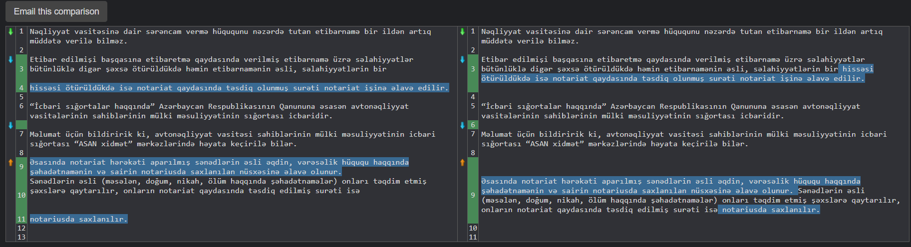

# Image to Text Converter

[Русский](/README_ru.md)

## Description

This application allows converting images to text using Optical Character Recognition (OCR). You can choose an image for processing from the file system or use an image from the clipboard.

# Install 
```
git clone https://github.com/reyquazar/image-to-text.git
```
## Dependencies

```
pip install -r req.txt
```

## Requirements

- Python 3.10
- Pillow (PIL) library
- pytesseract library
- tkinter library

## Installation [Tesseract OCR](https://digi.bib.uni-mannheim.de/tesseract/tesseract-ocr-w64-setup-5.3.3.20231005.exe)

In the program, the path is specified as:

```python
pytesseract.pytesseract.tesseract_cmd = r'C:\Program Files\Tesseract-OCR\tesseract.exe'
```

Please install it using the same path, and make sure to select the Russian language in the installer.

## Usage

There are 4 buttons:

1. Clipboard - takes an image from the clipboard
2. Browse - selects a local image
3. Copy - copies the recognized text
4. Delete - clears the field

# Comprasion
LEFT -- main.py
RIGHT -- original text 


